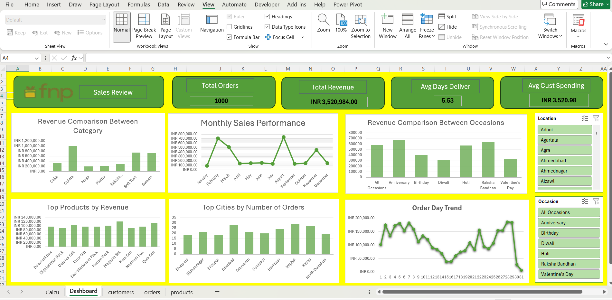

---

# Ferns & Petals Sales Analysis Dashboard

## Project Overview

This project analyzes sales data from **Ferns & Petals (FNP)**, a company specializing in online gifting for various occasions such as **Diwali, Raksha Bandhan, Holi, Valentine's Day, Birthdays, and Anniversaries**.

The goal of this analysis is to uncover **key business insights related to sales performance, customer behavior, and product demand** to help the company improve its sales strategy and optimize customer satisfaction.

The project includes **data cleaning, transformation, data modeling, analysis, and dashboard creation in Excel**.

---

# Dashboard Preview

---

# Business Problems Addressed

The dashboard answers the following key business questions:

1. **Total Revenue** – What is the overall revenue generated?
2. **Average Order & Delivery Time** – How long does it take for orders to be delivered?
3. **Monthly Sales Performance** – How does revenue fluctuate across months?
4. **Top Products by Revenue** – Which products generate the highest revenue?
5. **Customer Spending Analysis** – What is the average customer spending?
6. **Sales Performance of Top 5 Products** – Which products drive the most sales?
7. **Top 10 Cities by Orders** – Which cities place the most orders?
8. **Order Quantity vs Delivery Time** – Do larger orders affect delivery time?
9. **Revenue by Occasion** – Which occasions generate the most revenue?
10. **Product Popularity by Occasion** – Which products sell best during specific occasions?

---

# Tools & Technologies Used

### Data Processing

* **Power Query**

  * Data extraction
  * Data cleaning
  * Data transformation

### Data Modeling

* **Power Pivot**

  * Created a **Star Schema Data Model**
  * Established relationships between tables

### Data Analysis

* **Excel Pivot Tables**
* **Measures & Calculated Fields**

### Data Visualization

* Interactive **Excel Dashboard**
* Slicers for filtering:

  * Location
  * Occasion

---

# Data Model (Star Schema)

The dataset was structured using a **Star Schema** for efficient analysis.

**Fact Table**

* Orders

**Dimension Tables**

* Customers
* Products
* Dates

This model enables efficient aggregation and analysis across different dimensions.

---

# Key Insights

### Sales Overview

* **Total Revenue:** ₹3.52M
* **Total Orders:** 1000
* **Average Customer Spending:** ₹3,520
* **Average Delivery Time:** 5.53 days

### Product Insights

* Gift bundles and decorative items generate the highest revenue.
* Top products contribute a significant portion of total sales.

### Occasion Insights

* **Anniversary and Raksha Bandhan** generate the highest revenue.
* Seasonal events strongly influence purchasing behavior.

### Geographic Insights

* Cities such as **Imphal, Dhanbad, Kavali, and Haridwar** generate the most orders.

---

# Project Workflow

1. Data Extraction using **Power Query**
2. Data Cleaning and Transformation
3. Data Modeling using **Power Pivot**
4. Creating relationships using **Star Schema**
5. Data Analysis using **Pivot Tables and Measures**
6. Dashboard Creation in **Excel**
7. Executive Summary presentation

---

# Skills Demonstrated

* Data Cleaning
* Data Transformation
* Data Modeling
* Star Schema Design
* Data Analysis
* Business Intelligence
* Dashboard Development
* Data Storytelling

---

# Business Recommendations

* Increase inventory for **top-performing products**
* Launch **targeted marketing campaigns during major occasions**
* Optimize logistics for **high-demand cities**
* Introduce **occasion-based product bundles** to increase average order value

---

# Author

**Arijit Chandra**

Aspiring **Data Analyst | Power BI | Excel | SQL | Python**
